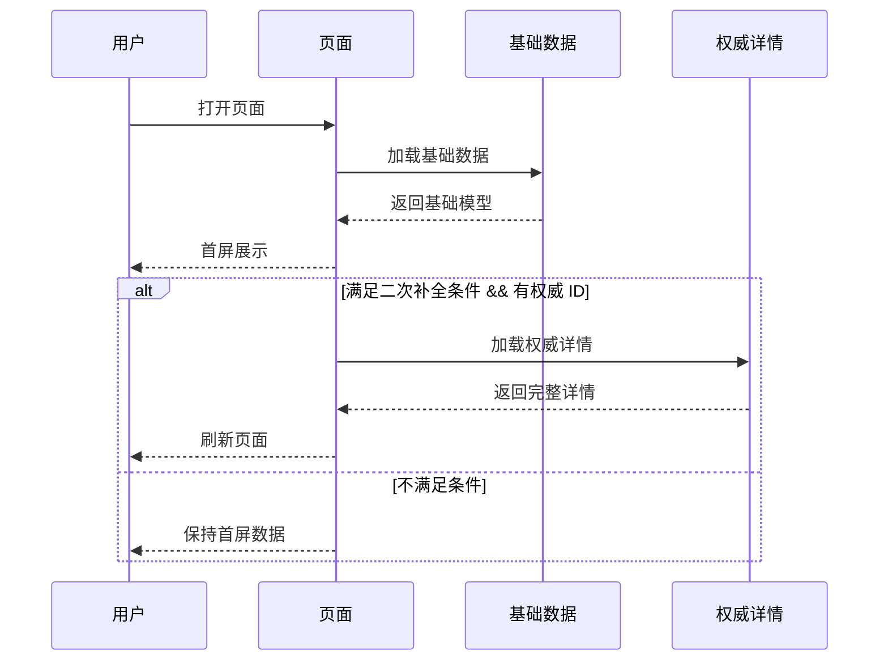
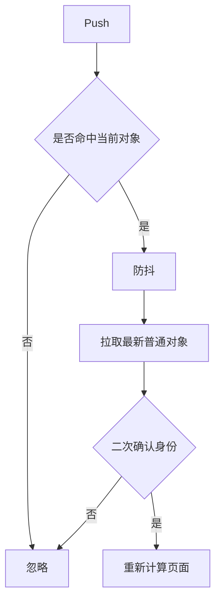

# 业务导读文档模板

这是紧凑检查清单，不是必须逐字套用的固定模板。

## Frontmatter

```markdown
---
title: <业务导读标题>
module: <模块路径或业务域>
tags:
  - 业务导读
  - <Domain>
updated: YYYY-MM-DD
---
```

## 业务摘要

用一段 callout：

```markdown
> [!summary]
> <这个模块是用户完成 ... 的主入口。它根据 ... 动态调整 ...，帮助用户 ...>
```

## 核心章节

### 业务定位

回答：

- 模块为用户完成什么任务？
- 它帮助用户做什么判断或动作？
- 为什么它是业务关键路径？

### 典型用户场景

表格列：

- 场景
- 用户问题
- 页面/模块要回答什么

### 业务对象与关键字段

表格列：

- 字段/对象
- 业务含义
- 解决什么问题

只写影响身份、权限、source of truth、状态流转、破坏性动作的字段。

### 权限与可见性

至少加入一个矩阵：

- 用户/对象状态
- 关键信息块
- 主动作
- 更多操作
- 隐藏或受限原因

### 动作可见性与状态转移

对关键动作说明：

- 可见条件
- 隐藏条件
- 写回结果
- 页面结果
- 失败行为

高频误判动作要加入最小判定链。

### 重点数据链路

按需覆盖：

- 初次加载。
- 二次补全 / 服务端详情刷新。
- Push 或异步刷新。
- 用户动作回写。
- 实时状态链路。
- 外部链接或分享链路。

每条链路说明：

- 触发条件。
- Source of truth。
- 关键字段。
- 成功覆盖行为。
- 失败行为。

### 数据覆盖与失败策略

表格列：

- 场景
- 成功时谁覆盖页面
- 失败时如何处理
- 业务原因

说明优先级是业务期望还是严格执行顺序。

### 高风险边界

常见高风险：

- 重复或范围型业务对象。
- 从原序列中分叉出来的例外对象。
- 隐私、加密或受限可见。
- 外部系统字段不完整。
- 本地写操作后又收到异步刷新。
- 带 span/range 的破坏性动作。

### 排障入口

表格列：

- 业务现象。
- 优先判断字段/条件。
- 代码入口。

为最高频的 3-5 个问题补有序排查链。

### 代码定位索引

放在靠后位置：

- 业务入口 / Builder。
- 数据 Reformer / Adapter。
- 统一模型。
- 页面外壳。
- 组件展示规则。
- 动作处理。
- 监控与日志。

已知时写文件路径和行号锚点。

## Mermaid 图模板

### 条件性二次补全



### Push 刷新


