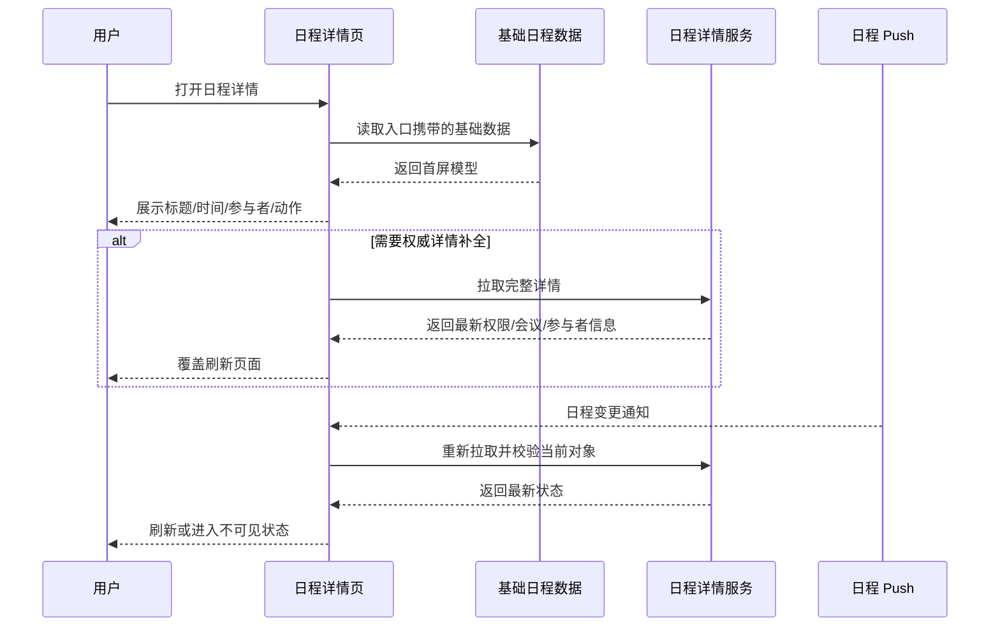

# 典型示例：从日程详情页代码沉淀业务导读

这个示例用于校准输出风格：业务判断先行，代码定位靠后；图解用于解释数据链路，不用于堆类关系。

## 输入

```text
目标目录：
/Modules/LarkTime/Bizs/Calendar/Calendar/Detail(MVVM)

用户要求：
梳理一份 Obsidian 友好的业务导读文档，业务层面为主，代码链路为辅，涵盖重点业务数据链路讲解和图解。
```

## 推荐输出片段

### 业务摘要

```markdown
> [!summary]
> 日程详情页是用户理解、参与和管理单个日程的核心入口。它围绕“这个日程是什么、我和它是什么关系、我现在能做什么”组织信息，并根据日程来源、参与身份、权限、会议状态和异步刷新结果动态调整展示与动作。
```

### 典型用户场景

| 场景 | 用户问题 | 页面要回答什么 |
| --- | --- | --- |
| 收到会议邀请后打开详情 | 我是否要参加？时间地点是否冲突？ | 标题、时间、地点、参与者、RSVP 状态、冲突提示 |
| 会议开始前查看详情 | 如何入会或改期？ | 视频会议入口、会议室、提醒、编辑/转让/取消能力 |
| 会议进行中打开详情 | 当前能否加入会议？ | 实时会议状态、Join 入口、会议链接有效性 |
| 组织者管理日程 | 是否能修改、取消、通知参与者？ | 管理权限、影响范围、操作后的写回结果 |

### 业务对象与关键字段

| 对象/字段 | 业务含义 | 解决的问题 |
| --- | --- | --- |
| `calendarId` | 日程归属日历 | 决定可见性、编辑权限和跨日历边界 |
| `key` / `originalTime` | 单次实例或重复日程序列定位 | 决定操作影响当前实例还是整个序列 |
| `meetingRoom` | 会议室资源 | 决定地点展示、资源冲突和会议室释放 |
| `attendees` / `selfAttendeeStatus` | 参与者与我的 RSVP | 决定参与状态、按钮文案和提醒策略 |
| `videoMeeting` | 视频会议能力 | 决定是否展示 Join 入口和实时状态 |

### 权限与动作矩阵

| 用户身份/日程状态 | 可见信息 | 主动作 | 受限原因 |
| --- | --- | --- | --- |
| 组织者 + 普通日程 | 完整信息 | 编辑、取消、转让、通知 | 无 |
| 普通参与者 + 已邀请 | 与自己相关的信息 | 接受/拒绝/暂定、加入会议 | 不能修改全局日程 |
| 资源日历或外部来源 | 可能缺少部分字段 | 查看为主 | 权威数据或权限不在本端 |
| 已删除或无权限 | 空态或错误态 | 返回/刷新 | 后端判定对象不可见 |

### 重点数据链路



链路说明要补清：

- 首屏数据解决“先能看见”的问题，不一定是最终权威数据。
- 服务端详情解决权限、参与者、会议状态等最终判断问题。
- Push 只表示“可能变化”，命中当前对象后仍要二次拉取和校验。
- 用户写操作成功后，页面应以写回结果或后续服务端刷新作为新的 source of truth。

### 排障入口

| 业务现象 | 优先判断 | 代码入口写法 |
| --- | --- | --- |
| Join 按钮不展示 | 是否有视频会议信息、会议是否有效、当前身份是否可加入 | 写到具体 ViewModel / Section / Button 构造入口 |
| 编辑入口消失 | 当前用户是否组织者、日历是否可编辑、是否外部来源 | 写到权限计算与更多菜单入口 |
| Push 后页面没变 | Push 是否命中当前 `calendarId + key + originalTime`，刷新是否被防抖或失败 | 写到 Push 订阅和刷新触发入口 |
| 取消日程影响范围错误 | 是否重复日程，操作选择当前实例还是整个序列 | 写到删除/取消动作处理入口 |

### 代码定位索引

代码索引应短而准：

```markdown
| 业务职责 | 代码入口 | 阅读目的 |
| --- | --- | --- |
| 页面装配 | `<path>/...Builder.swift` | 看入口参数如何转成详情上下文 |
| 数据整形 | `<path>/...Reformer.swift` | 看基础数据和服务端详情如何合并 |
| 权限判断 | `<path>/...ViewModel.swift` | 看按钮、菜单、信息块如何显隐 |
| 用户动作 | `<path>/...ActionHandler.swift` | 看编辑、取消、RSVP、Join 的写回链路 |
| 异步刷新 | `<path>/...PushHandler.swift` | 看 Push 命中与重新拉取逻辑 |
```

## 反例

不要这样开篇：

```markdown
本目录采用 MVVM 架构，包含 ViewController、ViewModel、Model、Router、Service。ViewController 负责 UI，ViewModel 负责业务逻辑……
```

问题在于它只解释代码分层，没有回答用户场景、权限、数据链路和业务风险。代码结构可以放在末尾索引，但不能替代业务导读。
