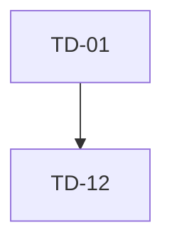

# 技术债报告模板

```markdown
---
title: <模块> 技术债盘点：<子模块>
date: <YYYY-MM-DD>
module: <业务模块>
scope: <repo-relative-code-scope>
aliases:
  - <别名>
tags:
  - technical-debt
  - lark-ios
  - larktime
  - harness
status: draft
evidence_commit: <commit-sha>
last_verified_commit: <commit-sha>
owner: <module-owner-or-team>
expected_pr_owner: <to-be-confirmed>
review_owner:
  - <owner-from-OWNERS>
target_phase: harness-readiness
related_prs: []
---

# <模块> 技术债盘点：<子模块>

> [!info] 结论摘要
> 用 2-3 句话说明主要债务形态，以及对 harness 接入最关键的阻塞。

## 决策摘要

### 一页结论

| 结论 | 判断 |
| --- | --- |
| 是否建议立刻接入 harness | <建议> |
| 最小治理范围 | <P0/Blocker 范围> |
| 不建议现在做的事 | <明确非目标> |
| Owner 需要拍板的内容 | <DRI / CI / 数据 / 节奏> |

### Owner 只需确认

- [ ] <DRI / PR owner>
- [ ] <CI job / test filter>
- [ ] <P0 范围>
- [ ] <线上 bug、crash、flaky 或历史回归数据>
- [ ] <里程碑节奏>

### 里程碑计划

| 里程碑 | 目标 | 覆盖技术债 | 交付物 | 可验收信号 |
| --- | --- | --- | --- | --- |
| M1 | <目标> | <TD> | <交付物> | <信号> |
| M2 | <目标> | <TD> | <交付物> | <信号> |
| M3 | <目标> | <TD> | <交付物> | <信号> |

### 明确不做

- <非目标 1>
- <非目标 2>
- <非目标 3>

## 范围与基线

### 基本信息

- **分析日期**：<YYYY-MM-DD>
- **分析范围**：`<repo-relative-code-scope>`
- **代码规模**：<文件数/行数>
- **证据 commit**：`<commit-sha>`
- **最后校验 commit**：`<commit-sha>`
- **Owner**：<owner>
- **Review owner**：<review owners>
- **治理阶段**：`harness-readiness`

### 验证与 CI 基线

> [!important] CI 基线命令
> - **单测命令**：`<test-command>`
> - **测试目录**：`<repo-relative-test-path>`
> - **测试 bundle 线索**：`<test-bundle-or-target>`

准入标准：

- <测试必须进入的集合>
- <禁止依赖真实网络/在线 API/全局状态>
- <失败归因和日志要求>

### 模块结构

- `<directory-or-component>`：<职责>

### harness 关联度定义

| 分级 | 含义 |
| --- | --- |
| Blocker | 不处理会直接阻碍首批 harness 接入。 |
| Stabilizer | 不处理也能接入，但会导致 flaky 或等待条件脆弱。 |
| Coverage | 主要影响覆盖扩展或局部动作验证。 |
| Low | 主要是维护噪声。 |

## 分析摘要

### 证据索引

| TD | harness 分级 | 关键证据 |
| --- | --- | --- |
| TD-01 | Blocker | `<repo-relative-file>:<line>` |

### 风险量化排序

评分口径：`入口覆盖面 + harness 阻塞程度 + 变更频率 + 回归可观测性缺口`，每项 1-5 分。

| TD | 入口覆盖面 | 阻塞程度 | 变更频率 | 可观测性缺口 | 总分 | 排序理由 |
| --- | ---: | ---: | ---: | ---: | ---: | --- |
| TD-01 | 5 | 5 | 5 | 5 | 20 | <理由> |

### 业务场景影响矩阵

| 场景入口 | 主要风险 TD | 影响说明 | 首批 harness 建议 |
| --- | --- | --- | --- |
| `<scene>` | <TD> | <影响> | <建议> |

### TD 依赖关系



## 技术债清单

### TD-01 <标题>

- **harness 分级**：Blocker / Stabilizer / Coverage / Low
- **优先级**：P0 / P1 / P2
- **证据**：`<repo-relative-file>:<line>`，<说明>
- **影响**：<影响>
- **建议**：<治理建议>
- **harness 切入点**：<fixture/snapshot/idle/effect/decision 等>
- **首个 PR 范围**：<小步改动>
- **验收标准**：<可验证标准>
- **迁移风险**：<风险>
- **verification_plan**：
  - 测试文件：`<repo-relative-test-file>`
  - fixture：`<fixture-name>`
  - 断言字段：`<fields>`
  - CI 入口：`<test-target-or-command>`
  - 回滚策略：<回滚策略>

## 治理计划

### 可执行治理队列

| PR | 目标 | 对应 TD | 验收信号 | 回滚策略 |
| --- | --- | --- | --- | --- |
| PR-1 | <目标> | TD-01 | <信号> | <策略> |

### 全局准入与回滚

> [!check] 准入条件
> - <准入条件>

> [!warning] 仍需 Owner 确认
> - <待确认项>

## 附录

### 关键代码索引

- `<repo-relative-file>`：<作用>

### 后续建议

> [!todo] 下一步
> <建议下一步>
```

## 注意事项

- 模板中的路径必须替换成仓库相对路径或用户提供的相对输出路径。
- 不要写本机绝对路径。
- 不要把同一个结论拆成多个重复章节；优先合并到 `决策摘要`、`分析摘要`、`治理计划`。
